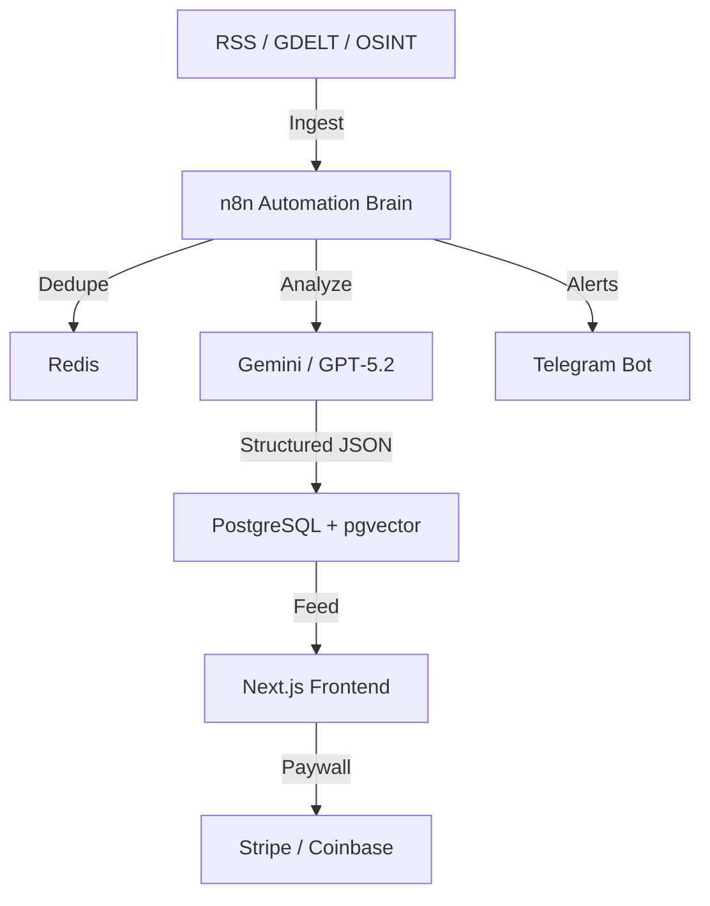

# MetaNews — Hybrid OSINT & Market Intelligence Platform (GEMINI MASTER SPEC)

**Status:** Definitive Build Document (v1.0 — Frozen)
**Repository:** [https://github.com/NukeThemAII/MetaNews.git](https://github.com/NukeThemAII/MetaNews.git)
**Role:** Core Developer / Architect
**Objective:** Build an autonomous, noise‑filtered intelligence engine that converts global noise into actionable signal.

---

## 0. One‑Sentence Definition

MetaNews is a real‑time OSINT and market‑intelligence engine that detects, verifies, scores, and distributes events that actually matter — faster than mainstream media, with quantified confidence and impact modeling.

**Mental model:** Bloomberg Terminal × OSINT × AI — for individuals.

---

## 1. Core Product Principles (Non‑Negotiable)

1. **Signal over noise:** Automatically discard ≥70% of inputs.
2. **Speed first:** Latency is alpha.
3. **Machine‑filtered, analyst‑style:** Structured intelligence, not raw text.
4. **Tiered access:** Free = delayed context; Premium = real‑time edge.
5. **Scored events:** Every event has a `severity (0–100)` and `confidence (0–1)`.

---

## 2. High‑Level System Architecture



---

## 3. Technology Stack

* **Automation:** n8n Community Edition (Docker)
* **LLMs:** Google Gemini (Flash = speed, Pro = depth), **GPT‑5.2** (reasoning, scoring, synthesis)
* **Images:** Gemini Banana (thumbnails, event cards)
* **AI Orchestration:** LangChain (via n8n Advanced AI)
* **Database:** PostgreSQL 15 + pgvector, Redis (queue/cache)
* **Frontend:** Next.js (App Router), Tailwind CSS, Recharts
* **Infra:** Docker, Nginx Proxy Manager, Ubuntu VPS

---

## 4. Source Strategy (Free‑First)

* **Global events:** GDELT API, ReliefWeb, UN OCHA
* **Markets:** Yahoo Finance RSS, SEC 8‑K, CoinDesk
* **Incidents:** FAA / ICAO bulletins, Maritime Executive
* **Social OSINT:** Curated Telegram channels (read‑only bridge)

---

## 5. Intelligence Model (MANDATORY SCHEMA)

The AI **must** output strictly valid JSON. Invalid output is discarded.

```json
{
  "category": "War | Market | Disaster | Tech | Policy | Crypto | Energy | Other",
  "severity": 85,
  "confidence": 0.92,
  "market_impact": "none | low | medium | high",
  "entities": ["$BTC", "BlackRock", "Ukraine"],
  "geo": { "lat": 48.3794, "lon": 31.1656 },
  "timestamp_utc": "ISO‑8601",
  "title": "Neutral, factual headline",
  "alert": "One‑sentence urgent alert",
  "summary": [
    "What happened",
    "Why it matters",
    "What to watch next"
  ]
}
```

**Scoring guidance (AI‑enforced):**

* Severity ≥80 = market‑moving / geopolitical
* Confidence <0.5 = discard

---

## 6. n8n Core Workflows

**WF‑01 — Ingestion (Watcher)**

* Cron: every 2 minutes
* Fetch RSS / APIs → normalize → hash URL
* Redis `seen_urls` (TTL 24h)

**WF‑02 — Intelligence (Analyst)**

* LangChain chain:

  * Prompt template
  * Gemini Flash → GPT‑5.2 verifier
* Output: strict schema JSON

**WF‑03 — Gatekeeper (Filter)**

* Drop if `severity < 40` OR `confidence < 0.5`
* Route:

  * ≥80 → instant alert
  * 40–79 → delayed feed

**WF‑04 — Distribution**

* Premium: instant Telegram + live feed
* Free: 30–60 min delay + daily digest

---

## 7. Database Schema (PostgreSQL)

```sql
CREATE EXTENSION IF NOT EXISTS "uuid-ossp";
CREATE EXTENSION IF NOT EXISTS "pg_trgm";
CREATE EXTENSION IF NOT EXISTS "vector";

CREATE TYPE event_category AS ENUM ('War','Market','Disaster','Tech','Policy','Crypto','Energy','Other');
CREATE TYPE market_impact AS ENUM ('none','low','medium','high');

CREATE TABLE events (
  id UUID PRIMARY KEY DEFAULT uuid_generate_v4(),
  source_hash VARCHAR(64) UNIQUE NOT NULL,
  title TEXT NOT NULL,
  summary JSONB NOT NULL,
  category event_category NOT NULL,
  severity INTEGER CHECK (severity BETWEEN 0 AND 100),
  confidence DECIMAL(3,2) CHECK (confidence BETWEEN 0 AND 1),
  market_impact market_impact DEFAULT 'none',
  entities JSONB DEFAULT '[]'::jsonb,
  geo JSONB,
  embedding VECTOR(768),
  published_at TIMESTAMPTZ NOT NULL,
  created_at TIMESTAMPTZ DEFAULT NOW()
);
```

---

## 8. Execution Order

1. `docker compose up -d`
2. Run DB schema
3. Import n8n workflows JSON
4. Deploy frontend

---

## 9. Non‑Goals

* No social network
* No opinionated content
* No manual curation at scale
