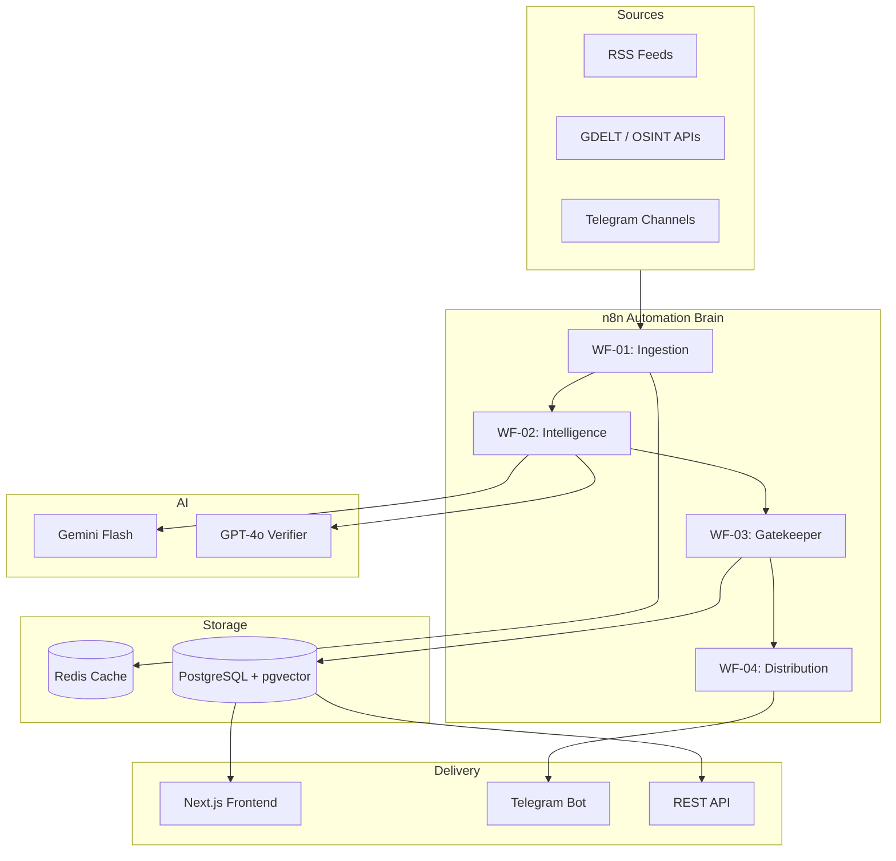

# MetaNews — Hybrid OSINT & Market Intelligence Platform

**Status:** Production-Ready Specification (v2.0)  
**Repository:** [https://github.com/NukeThemAII/MetaNews.git](https://github.com/NukeThemAII/MetaNews.git)  
**Updated:** 2026-01-03

---

## 0. One‑Sentence Definition

MetaNews is a real‑time OSINT and market‑intelligence engine that detects, verifies, scores, and distributes events that actually matter — faster than mainstream media, with quantified confidence and impact modeling.

**Mental model:** Bloomberg Terminal × OSINT × AI — for individuals.

---

## 1. Core Product Principles

| # | Principle | Implementation |
|---|-----------|----------------|
| 1 | **Signal over noise** | Discard ≥70% via AI scoring |
| 2 | **Speed first** | 2-min ingestion cycle, instant premium alerts |
| 3 | **Machine-filtered** | Structured JSON, not raw text |
| 4 | **Tiered access** | Free = 30-60min delay; Premium = real-time |
| 5 | **Scored events** | `severity (0–100)` + `confidence (0–1)` |

---

## 2. System Architecture



---

## 3. Technology Stack

| Layer | Technology | Purpose |
|-------|------------|---------|
| **Automation** | n8n Community Edition | Workflow orchestration |
| **AI - Fast** | Gemini 1.5 Flash | Classification, initial scoring |
| **AI - Deep** | GPT-4o | Verification for high-severity |
| **AI - Fallback** | Claude 3 Haiku | Cost-effective backup |
| **Cache** | Redis 7 | Deduplication, semantic cache |
| **Database** | PostgreSQL 16 + pgvector | Events, users, embeddings |
| **Frontend** | Next.js 14 (App Router) | Web UI |
| **Styling** | Tailwind CSS | Design system |
| **Charts** | Recharts | Visualizations |
| **Infra** | Docker + Nginx | Containerization, reverse proxy |

---

## 4. Data Sources

### Free-Tier Sources

| Category | Source | Endpoint | Interval |
|----------|--------|----------|----------|
| Global Events | GDELT | `api.gdeltproject.org/api/v2/doc/doc` | 2 min |
| Humanitarian | ReliefWeb | `api.reliefweb.int/v1/reports` | 5 min |
| Humanitarian | UN OCHA | HDX API | 10 min |
| Markets | Yahoo Finance | RSS | 2 min |
| Regulatory | SEC EDGAR | 8-K filings | 5 min |
| Crypto | CoinDesk | RSS | 3 min |
| Aviation | FAA NOTAM | Bulletins | 10 min |
| Maritime | Maritime Executive | RSS | 10 min |

### Premium Sources

- Curated Telegram channels (read-only MTProto)
- Twitter/X Lists (API v2)
- Bloomberg Terminal feed (enterprise)

---

## 5. Intelligence Schema

All AI outputs **must** conform to this JSON schema. Invalid outputs are discarded.

```json
{
  "category": "War | Market | Disaster | Tech | Policy | Crypto | Energy | Other",
  "severity": 85,
  "confidence": 0.92,
  "market_impact": "none | low | medium | high",
  "entities": ["$BTC", "BlackRock", "Ukraine"],
  "geo": { "lat": 48.3794, "lon": 31.1656 },
  "title": "Neutral, factual headline (max 100 chars)",
  "alert": "One-sentence urgent alert (max 200 chars)",
  "summary": [
    "What happened",
    "Why it matters",
    "What to watch next"
  ]
}
```

### Scoring Matrix

| Severity | Description | Examples |
|----------|-------------|----------|
| 80-100 | Market-moving, geopolitical | War outbreak, major acquisition, bank failure |
| 60-79 | Significant regional impact | Sanctions, rate hikes, large protests |
| 40-59 | Industry-specific | Earnings surprise, product launch |
| 0-39 | Low impact (filtered) | Routine news, minor updates |

### Confidence Thresholds

| Confidence | Action |
|------------|--------|
| ≥ 0.8 | High trust, instant publish |
| 0.5-0.79 | Publish with verification note |
| < 0.5 | **Discard** (unverified/rumor) |

---

## 6. n8n Workflows

All workflows are in `n8n-workflows/` as importable JSON.

### WF-01: Ingestion (Watcher)

```
Trigger: Cron (every 2 minutes)
Flow: Fetch Sources → Normalize → Hash URL → Redis Dedupe → Pass to WF-02
Features:
  - Batch processing (5 sources/batch)
  - Retry with exponential backoff
  - Circuit breaker (5 failures → disable source)
  - Source reliability tracking
```

### WF-02: Intelligence (Analyst)

```
Trigger: Webhook from WF-01
Flow: Semantic Cache Check → AI Analysis → Validation → Route
AI Chain:
  1. Gemini Flash → Classification + Initial Score
  2. GPT-4o → Verification (only if severity ≥ 60)
Features:
  - Semantic caching (1h TTL)
  - Schema validation with retry
  - Fallback to Gemini Pro on failure
```

### WF-03: Gatekeeper (Filter)

```
Trigger: Webhook from WF-02
Flow: Quality Gate → Priority Router → Database Insert → Distribution
Rules:
  - DROP if severity < 40 OR confidence < 0.5
  - INSTANT if severity ≥ 80
  - DELAY (30-60 min) if severity 40-79
```

### WF-04: Distribution

```
Trigger: Webhook from WF-03
Flow: Format Message → Tier Router → Send Alerts → Log
Channels:
  - Telegram (premium channel, free channel, DMs)
  - Web feed (via database)
Features:
  - User preference filtering
  - Delivery tracking
  - Error logging
```

---

## 7. Database Schema

Full schema in `db/schema.sql`. Key tables:

| Table | Purpose |
|-------|---------|
| `events` | Core intelligence events with embeddings |
| `sources` | Data source configuration and health |
| `users` | User accounts and preferences |
| `subscriptions` | Stripe payment status |
| `alerts` | Delivery tracking |
| `seen_urls` | Deduplication cache |
| `event_audit` | Change history |

### Critical Indexes

```sql
-- Feed query optimization
CREATE INDEX idx_events_feed ON events(category, severity DESC, published_at DESC)
    WHERE confidence >= 0.5;

-- Premium alerts
CREATE INDEX idx_events_premium ON events(severity DESC, published_at DESC)
    WHERE severity >= 80 AND confidence >= 0.5;

-- Vector similarity (semantic search)
CREATE INDEX idx_events_embedding ON events 
    USING ivfflat (embedding vector_cosine_ops);
```

---

## 8. Security

### Credential Management

All secrets via environment variables. See `.env.example`.

```bash
# Critical secrets (never commit!)
N8N_ENCRYPTION_KEY=      # openssl rand -hex 32
DB_POSTGRESDB_PASSWORD=
GEMINI_API_KEY=
OPENAI_API_KEY=
TELEGRAM_BOT_TOKEN=
STRIPE_SECRET_KEY=
JWT_SECRET=
```

### Best Practices

- [ ] TLS everywhere (Nginx + Let's Encrypt)
- [ ] Rate limiting on public endpoints
- [ ] RBAC for n8n (admin vs viewer)
- [ ] Regular secret rotation
- [ ] Audit logging enabled
- [ ] Input validation in all workflows

---

## 9. Observability

### Recommended Stack

| Tool | Purpose |
|------|---------|
| Prometheus | Metrics collection |
| Grafana | Dashboards & alerts |
| Loki | Log aggregation |
| Sentry | Error tracking |

### Key Metrics

```yaml
Business:
  - events_ingested_total
  - events_discarded_total
  - alerts_sent_total
  - active_premium_users

Performance:
  - llm_latency_seconds (by model)
  - source_fetch_duration_seconds
  - workflow_execution_duration

Cost:
  - llm_tokens_used_total (by model)
  - estimated_cost_usd
```

---

## 10. Cost Optimization

### AI Pipeline Strategy

| Route | Model | Cost/Event | Use Case |
|-------|-------|------------|----------|
| Fast | Gemini Flash | ~$0.0001 | All events (classifier) |
| Deep | GPT-4o | ~$0.003 | Severity ≥ 60 only |
| Cache Hit | None | $0 | Repeated content |

### Projected Savings

```
Without optimization: $0.0031/event
With smart routing:
  - 70% discarded: $0.0001
  - 20% cached: $0.0001
  - 10% full analysis: $0.0031
  
Weighted average: ~$0.0004/event (87% savings)
```

---

## 11. Deployment

### Quick Start

```bash
# 1. Clone
git clone https://github.com/NukeThemAII/MetaNews.git
cd MetaNews

# 2. Configure
cp .env.example .env
# Edit .env with your API keys

# 3. Start
docker compose up -d

# 4. Import workflows
# Open n8n at http://localhost:5678
# Import files from n8n-workflows/
```

### Production Checklist

- [ ] Set strong passwords in `.env`
- [ ] Configure SSL certificates
- [ ] Set up backup schedule
- [ ] Configure monitoring alerts
- [ ] Test webhook connectivity
- [ ] Verify Telegram bot setup

---

## 12. Non-Goals

- ❌ Social network features
- ❌ Opinionated/editorial content  
- ❌ Manual curation at scale
- ❌ Paywalled public data
- ❌ User-generated content

---

## 13. Roadmap

See `TODO.md` for detailed roadmap.

| Phase | Focus | Timeline |
|-------|-------|----------|
| 1 | Core infrastructure | Week 1 |
| 2 | AI pipelines | Week 2-3 |
| 3 | Frontend MVP | Week 3-4 |
| 4 | Payments & scale | Week 5+ |
